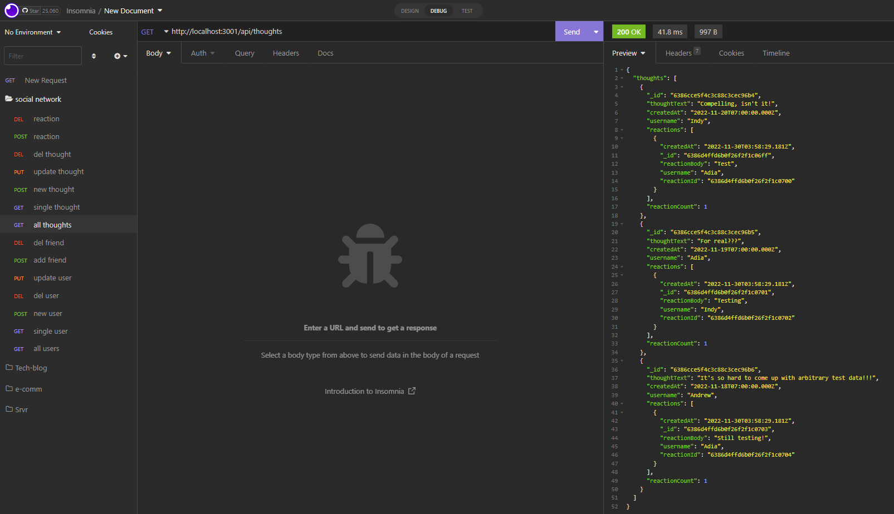
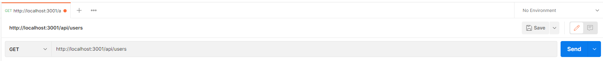
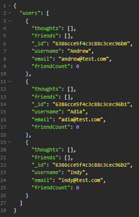

# social-network-API

Social-network-API is a backend mock up of a social media application, utilizing an Express server, MongoDb and the Mongoose Object Data Mapper (ODM for NoSQL database).

## Installation

* Fork and clone the repo
* Run "npm i" from the terminal command line
* Seed the database by entering "npm run seed" from the command line
* Run "npm run dev" from the command line to start the server

## Testing

Testing the API routes can be done with an API testing platform such as Postman or Insomnia.  Specific endpoints for all HTTP requests can be found in the routes folder.

To GET all users, paste the following URL:

`http://localhost:3001/api/users`

The return object should look like this:

## Conclusions

The project served an as introduction to MongoDb and NoSQL databases.  The biggest challenge I experienced, having recently spend a significant amount of time working with relational databases, was simply the syntactical difference of NoSQL vs. SQL.  The usage of Mongoose provided a loose structure which aided in joining data from one collection to the next.

##  Check it out

A walkthrough demonstration can be viewed here: [demo](https://drive.google.com/file/d/1Mtb4kwaQppuf4yFQSicthIaOTZsRybhc/view)

Please view my repo here: [GitHub](https://github.com/ObviousEcho/social-network-API)